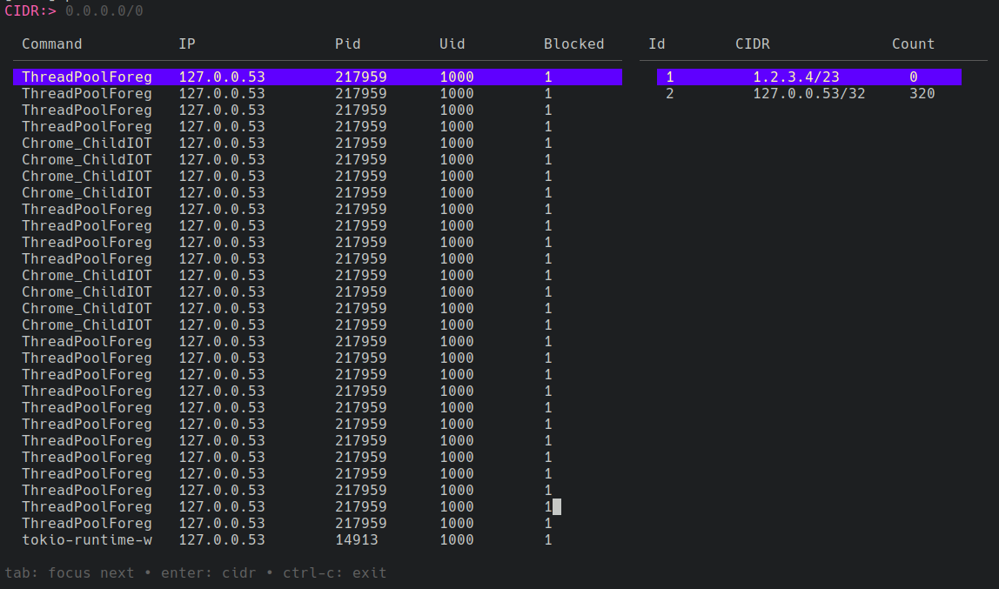

# Info
Neck stands for 'Neat, Eye-catching, Cute, Killer', although it's 
not actually a 'killer'. Rather, it's a cute tool designed 
to block egress traffic (acting as a policer) based on a given CIDR with a nice UI.



# Why
I wanted to test bubbletea with ebpf BPF_PROG_TYPE_CGROUP_SOCK_ADDR program type to get:
- knowledges about bubbletea,
- check BPF_PROG_TYPE_CGROUP_SOCK_ADDR program type constraints and behavior.
It took me one day to write this program, so it looks how it looks.

# Build and Run
Static:
```bash
make static
```
Dynamic:
```bash
make dynamic
```
Run from the build directory:
```bash
cd build
sudo ./neck-cli-<static|dynamic>
```

# Conclustions
- Bubbletea is a great tool for writing terminal applications. I'll definitely stick to it.
- BPF_PROG_TYPE_CGROUP_SOCK_ADDR program type is good choice for egress traffic filtering if you do not need to filter at the package level and do not have to kill running processes.